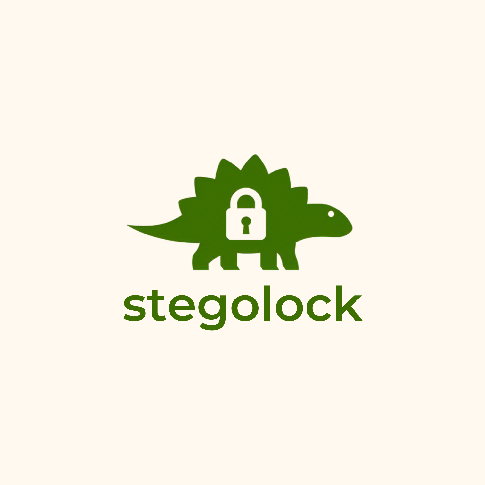
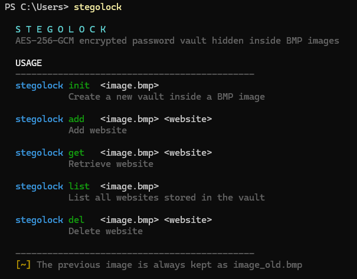

# stegolock
<p align="center">
  
</p>

An AES-256-GCM encrypted password vault hidden inside BMP images.

## Features

- **AES-256-GCM Encryption** - Encryption with authentication tags
- **Steganography** - Data hidden in BMP image with lsb
- **Password Protection** - Master password with Argon2id key derivation
- **Simple CLI** - Commands for vault management
- **Automatic Backups** - Previous images preserved as `*_old.bmp`

<p>
  
</p>

## Installation

### Requirements

- **Windows** - Project targets Windows
- **GCC** - MinGW or similar compiler with AES-NI support
- **Argon2** - Key derivation library (32-bit or 64-bit auto-detected)
- **Crypto Libraries** - Windows crypto API (crypt32, advapi32)

### Build

Simply run:

```bash
make
```

The Makefile automatically detects your system architecture (32-bit or 64-bit) and deploys the corresponding `argon2.dll`.


### Clean Build

```bash
make clean
```

Removes all build artifacts and temporary files.

## Usage

### Initialize a new vault

```bash
stegolock init image.bmp
```

Creates an encrypted vault inside the BMP image. You will be asked for a master password.

### Add an entry

```bash
stegolock add image.bmp github.com
```

Stores a username and password for a website.

### Retrieve an entry

```bash
stegolock get image.bmp github.com
```

Decrypts and displays stored credentials.

### List all entries

```bash
stegolock list image.bmp
```

Lists all websites in the vault.

### Delete an entry

```bash
stegolock del image.bmp github.com
```

Removes a stored credential from the vault.

## How It Works

### Encryption Flow

1. **Vault Serialization** - Password entries packed into binary format
2. **Key Derivation** - Master password → 256-bit key using Argon2 with random salt
3. **AES-256-GCM** - Encrypts vault with AES-NI acceleration, random IV, and authentication tag
4. **Data Layout** - `[Salt][IV][Tag][Ciphertext]` embedded in image via steganography

### Steganography

Data is hidden in the least significant bits (LSB) of BMP pixel values.

### File Backup

Before modifying an image, the original is renamed to `image_old.bmp`. This preserves your vault in case of corruption or accidental overwrite.

## Security Considerations

- **Master Password** - Never logged or written to disk
- **Argon2 KDF** - Modern password hashing with tunable work factor against brute-force attacks
- **AES-256-GCM** - Hardware-accelerated with AES-NI for both confidentiality and authenticity
- **Unique Salts** - Each vault uses a random salt and IV
- **Steganography** - Data hidden in BMP lsb
- **Backups** - Original images preserved as `*_old.bmp` (delete when no longer needed)

## Limitations

- **Windows-only** - Uses Windows API
- **BMP images only** - No support for JPEG, PNG, or other formats
- **Image size** - Must be large enough to hold encrypted vault (~1KB minimum recommended)
- **Vault capacity** - Limited by available image steganographic capacity

## License

MIT
